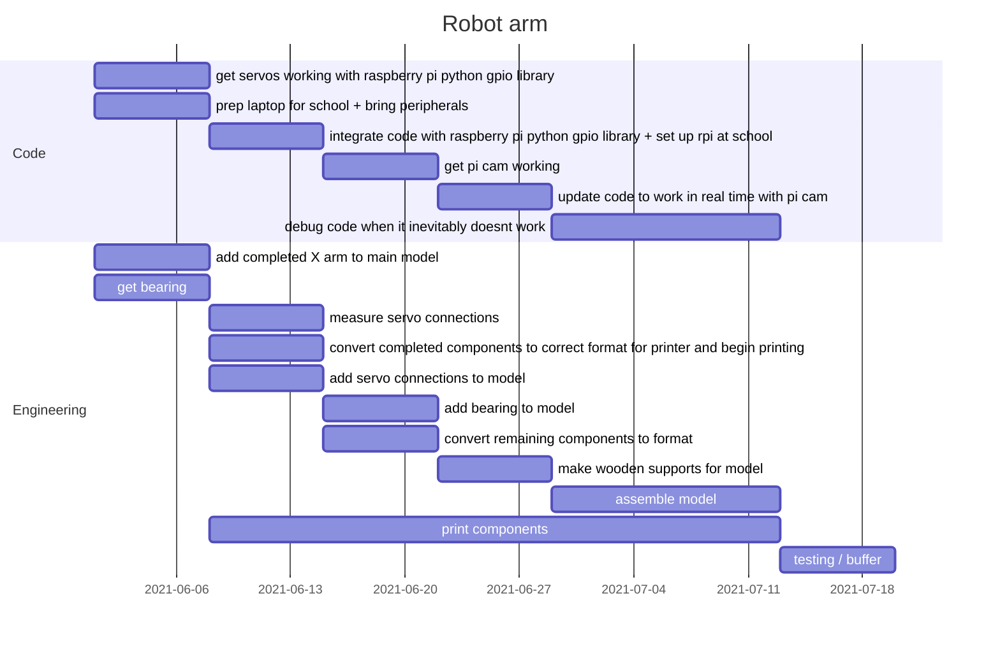

### Todo

- [x] fix rotation finder
- [ ] add hard limits on rotation
- [ ] get pi cam working
- [ ] update code to work in real time with pi cam
- [ ] test servo calculation code
- [ ] get servos working with raspberry pi python gpio library
- [ ] integrate code with raspberry pi python gpio library
- [ ] debug code when it inevitably doesnt work
- [ ] add completed X arm to main model
- [ ] add servo connections to model
- [ ] print model
- [ ] make wooden supports for model
- [ ] get bearing
- [ ] add bearing to model
- [ ] assemble
- [x] check sizes on model components

#### Need to be in school

- get picam, cables and servos
- print model
- make wooden supports
- assemble

|                   | Joe  | Pratyaksh | Akilan | Gwon | Hemanth | time (max) |
| ----------------- | ---- | --------- | ------ | ---- | ------- | ---------- |
| rotation finder   | X    | X         |        |      |         | 1h         |
| rotation limits   | X    | X         |        |      |         | 10m        |
| pi cam            | X    | X         |        |      |         | 2h         |
| pi cam code       | X    | X         |        |      |         | 1h         |
| test code         | X    | X         |        |      |         | 2h         |
| servo code        | X    | X         |        |      |         | 4h         |
| servo integration | X    | X         |        |      |         | 1h         |
| debug             | X    | X         |        |      |         | 3h         |
| X arm             | X    |           | X      | X    | X       | 30m        |
| servo connections | X    |           | X      | X    | X       | 3h         |
| print (setup)     | X    |           | X      | X    | X       | 10h        |
| wooden            | X    |           | X      | X    | X       | 2h         |
| bearing model     | X    |           | X      | X    | X       | 1h         |
| get bearing       | X    |           | X      | X    | X       | 10m        |
| assemble          | X    |           | X      | X    | X       | 6h         |
| sizes check       | X    |           | X      | X    | X       | 1h         |

total time: 14h code; 24 engineering

*(not all of this needs to be done in school but the extra time can act as buffer)*

### Notes:

- by next week we need to get picam and servos
- by 8 June get bearing

